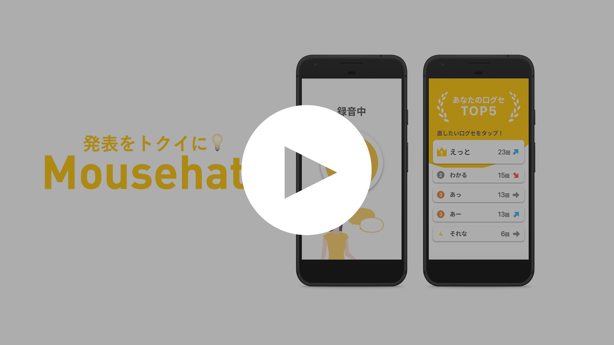

# Mousehat

## 製品概要
### 口癖 x Tech

### 背景（製品開発のきっかけ、課題等）
自分の口癖ってわからない上に他の人に指摘してもらいづらいと思うので，自分で気づいて直すのって難しいと思います．そこで，自分の口癖が出た時に振動して教えてくれるアプリを作成しました．
- 「えっと」などの口癖は人に指摘されないと気づきにくいという問題点
-  重要な場でしっかりと話せるように話す練習をしたい人向け
これを身に付けることで，口癖が出てしまった時に「ハッと」教えてくれます．
### 製品説明（具体的な製品の説明）

### 特長

#### 1. 特長1
自分の喋りを録音して口癖を収集してくれる

#### 2. 特長2
喋る時に口癖が出た時，スマートフォンが震えることで*本人だけ*に口癖が出たことを教えてくれる

### 解決出来ること
口癖を見つけて直したい人が口癖に気づき，自分で修正できる．

### 今後の展望
ユーザごとにログインシステムの作成や，

## 開発内容・開発技術
### 活用した技術
#### API・データ
今回スポンサーから提供されたAPI、製品などの外部技術があれば記述をして下さい。

* 形態素解析API(gooラボAPI)

#### フレームワーク・ライブラリ・モジュール
* React

#### その他(プロトタイプツール)
* Figma

### 研究内容・事前開発プロダクト（任意）

* アイデアの決定

### 独自開発技術（Hack Dayで開発したもの）
#### 2日間に開発した独自の機能・技術
* アプリケーションの画面や画面遷移等
* アプリケーション本体の処理
