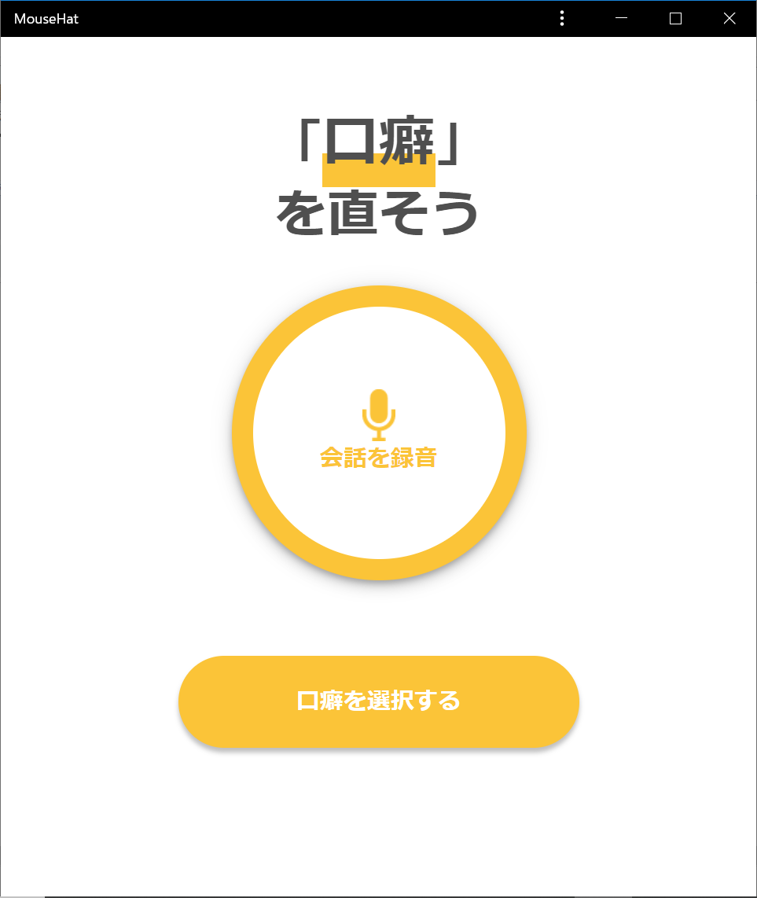
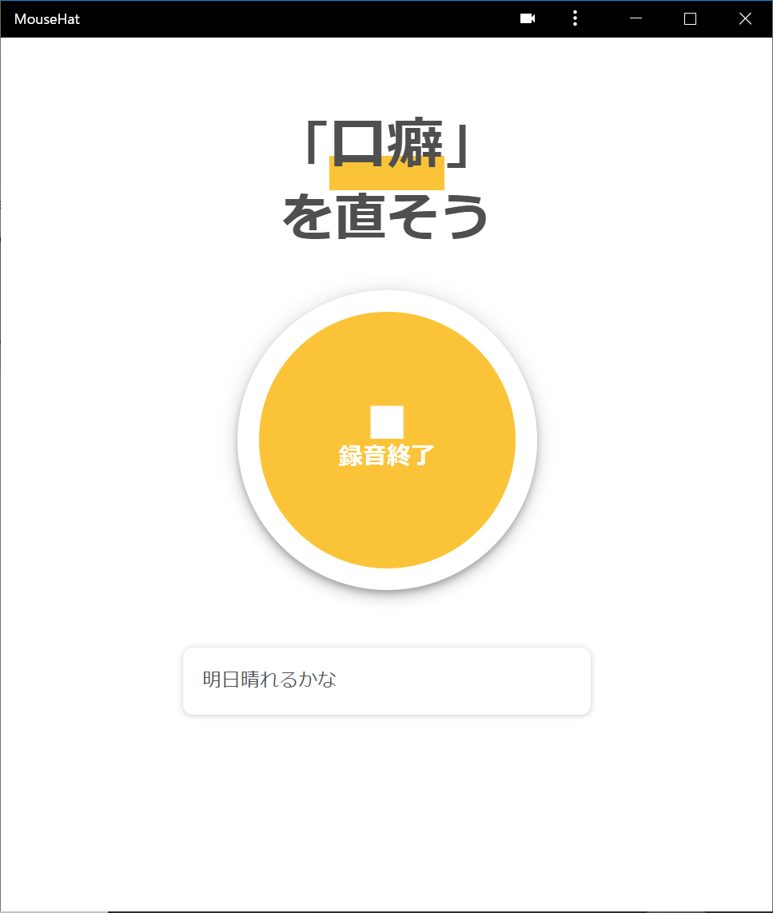
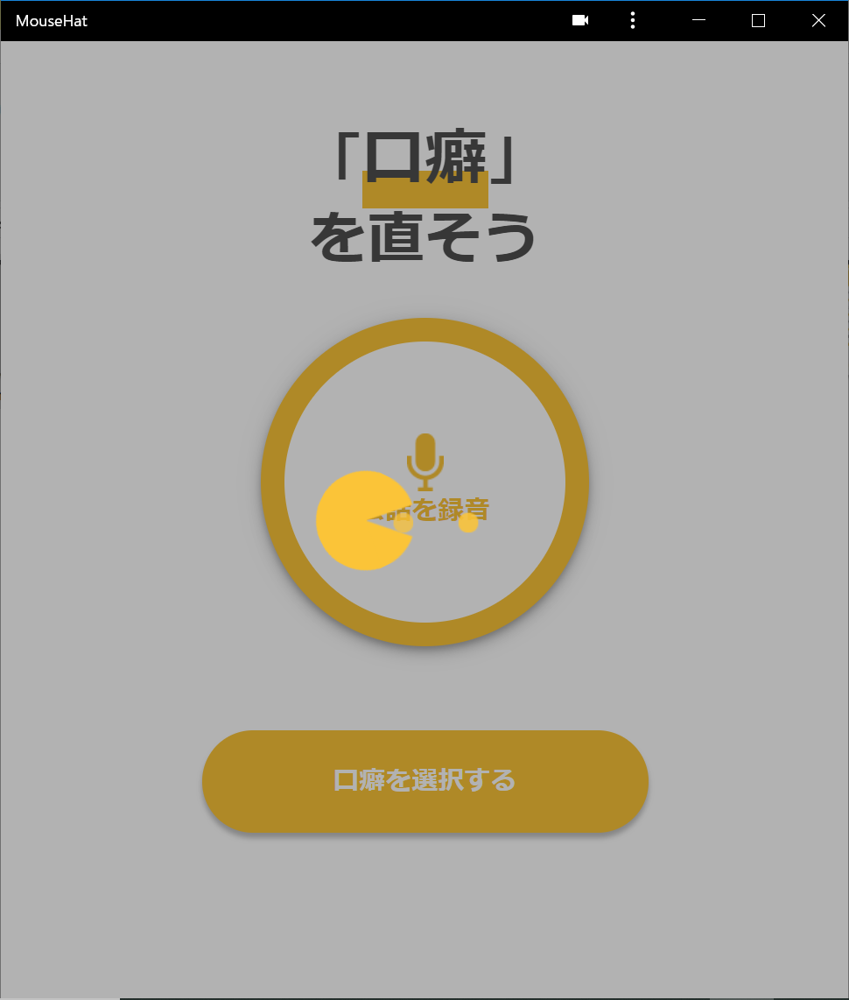
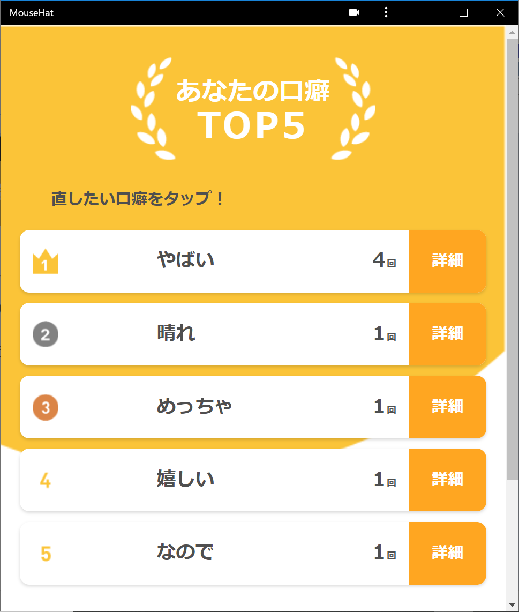
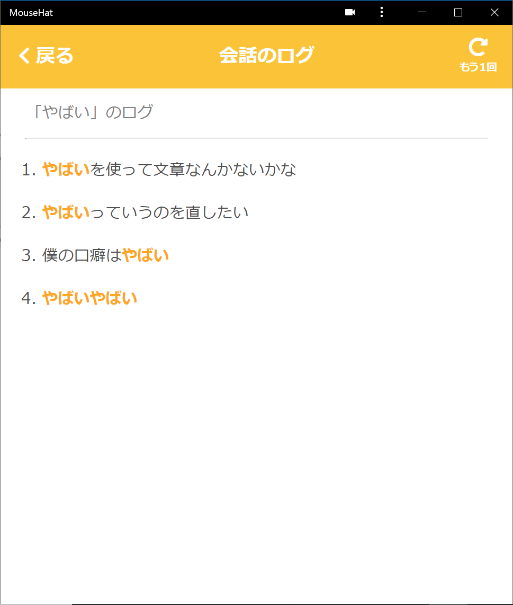
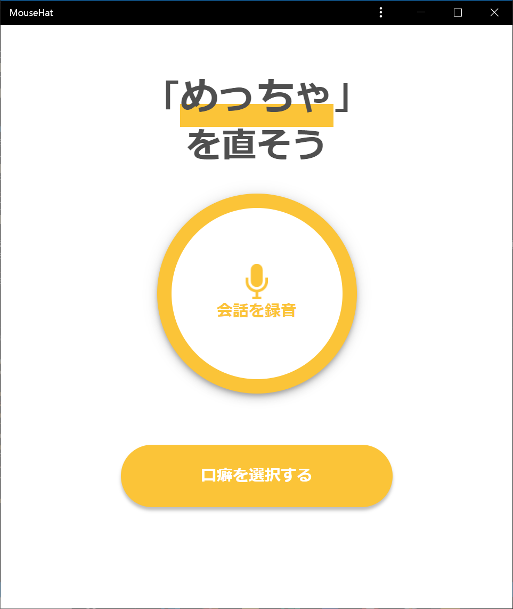
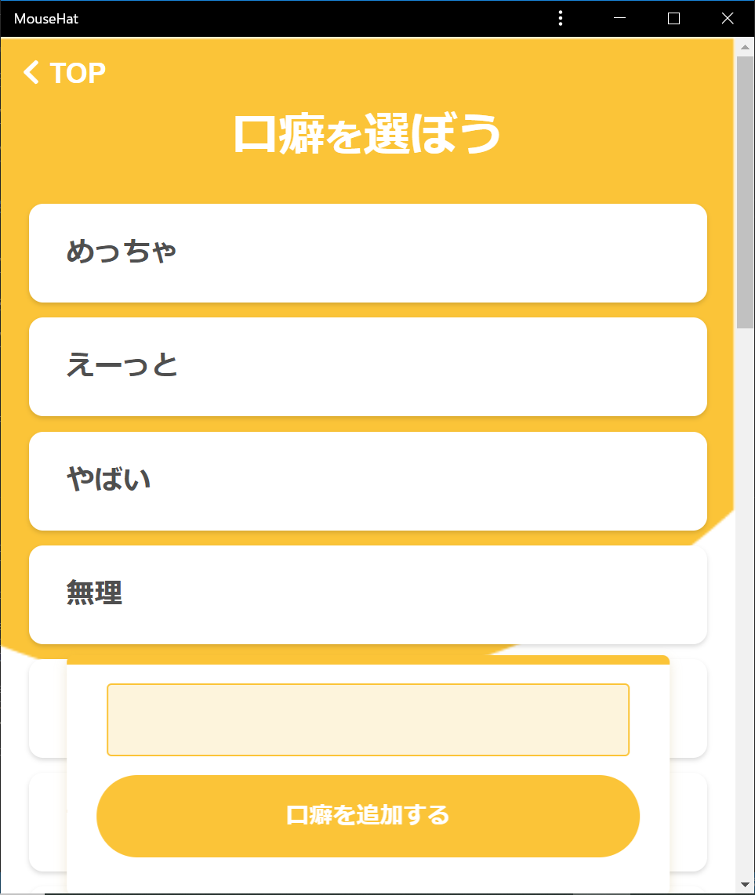
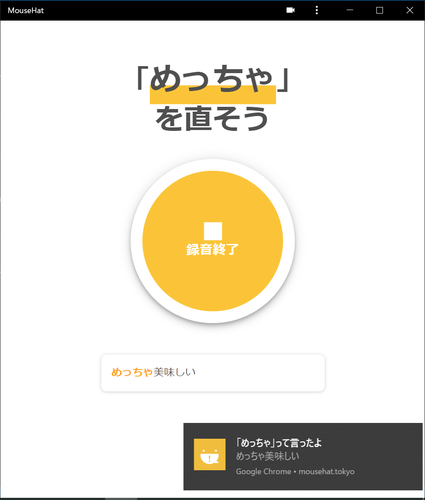

# Mousehatの使い方  
[Mousehat](https://mousehat.tokyo/)の使い方を簡単に解説します．  
必ず，Desktop，Android版のChromeを使用して下さい．

## 1.口癖を見つけたい場合  
口癖を見つけたい場合，まず録音ボタンを押します．  
  
すると会話の録音が始まります．この会話の内容から口癖を抽出するため，満足するまで録音しましょう．録音を終了するには終了ボタンを押します．  
  
終了ボタンを押すと，録音が終わり会話の内容の分析が始まります．
  
分析が終わると，結果画面に移ります．ここから自分の言った語句の中でも頻度が多いものが表示されます．  
  
詳細を押すと自分がその文でその口癖を話したかがわかります．  
  
結果画面か詳細画面で自分が直したいものを選んで下さい．すると次の章で紹介する口癖の検出モードに移行します．  

## 2.口癖を喋ったことに気が付きたい場合  
自分の設定した口癖をリアルタイムで検出することができます．  
選ぶボタンから口癖を選ぶか，前の章で見つけた口癖が選択されているはずです．  
  
正しく選択できている場合，上のところに '{選んだ口癖}を直そう．' と表示されます.  
  
選ぶ画面では，初期の口癖の他に自分で入力して，選択する事もできます．  
  
検出したい口癖が選択できたら，録音ボタンを押します．  
すると，検出モードになります．選択した口癖を言った瞬間にAndroidであればバイブレーションが，Desktopであればプッシュ通知がきます．  
この際にマナーモードなどにしていると通知が来ないため気をつけて下さい．  
以下はデスクトップ通知の例です．  
  
その後，終了ボタンで終了できます．この際に前の章のように，多い頻度の口癖を何回言ったかわかる結果が表示されます．  
頻度が多かったら，ぜひMousehatを使用して口癖にすぐ気づいて直しましょう．